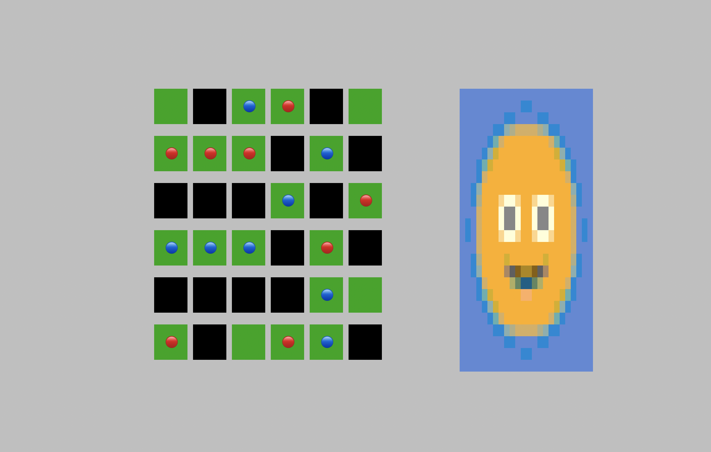

# Golang Terminal Games -- just for Fun and Learning! 

This is a repository of games that uses termloop to build games - just for fun! :D

## Why? Why? Why?

Games are the best way to learn while having fun! It challenges your logic as well as you learn new constructs.

## Connector
 
A cool paper puzzle game that I am converting into a game. 

## Pong

In this game, we mix pong and bricks! 

