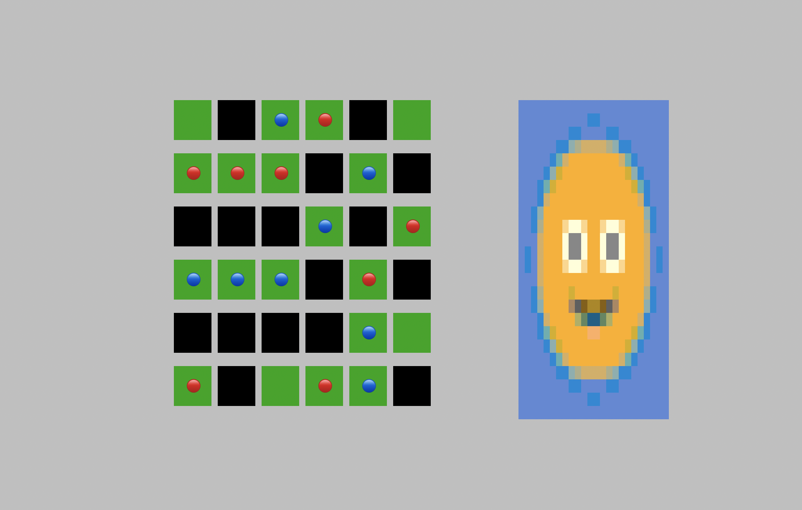

## Connector 

Just for fun, I'm trying to implement the 'Collector' game which I call "Connector"
[The paper game explained](https://mathwithbaddrawings.com/2020/04/22/six-strategic-games-from-a-strange-and-bottomless-mind/r)

Things to learn here:

* How to add icons as pixel images in terminal games
* Mouse event management 
* Good game logic building!

